<div align="center">

<a href="https://github.com/kevinbayter/kevinbayter/blob/main/README.md"></a>
<a href="https://github.com/kevinbayter/kevinbayter/blob/main/README.es.md"></a>



<br/>

<a href="https://bayterx.com"></a>
<a href="https://linkedin.com/in/kevin-bayter"></a>
<a href="mailto:kevin@bayterx.com"></a>


<br/><br/>


</div>

---

## `whoami`

Soy **Líder Técnico y Senior Software Engineer**, y dedico la mayor parte de mi tiempo a la versión difícil de la pregunta sobre IA: *no "¿puede un modelo hacer esto?", sino "¿puedo poner esto frente a producción y dormir tranquilo?"*

Construyo **sistemas agénticos que tocan infraestructura real** — clústeres, gateways, pipelines, dinero — con los guardrails, las compuertas de aprobación, la trazabilidad y los núcleos deterministas que los hacen lo bastante seguros como para desplegarlos de verdad. En paralelo, modernizo plataformas de pagos y construyo las plataformas internas por las que despliegan otros equipos.

Lidero construyendo: escribo las partes difíciles, defino la arquitectura y hago que los límites sean *exigibles*, para que el diseño sobreviva al tercer sprint del equipo bajo presión.

```yaml
rol:      Líder Técnico · Senior Software Engineer
foco:     ingeniería de IA · platform engineering · pagos
hoy:      WOM Colombia — modernización de pagos + plataforma interna de despliegue
antes:    Mercado Libre — backend, observabilidad y automatización con IA a escala
idiomas:  Español (nativo) · Portugués (avanzado) · Inglés (profesional)
creencia: "el modelo propone, el código decide, el humano aprueba"
```

---

## Impacto



- **Reduje el ruido de alertas en producción más de un 85%** con triage asistido por IA delante de la guardia — menos llamadas, diagnóstico más rápido, menos desgaste.
- **Convertí un ritual manual de ocho pasos en un solo clic**, con rollback disponible en cada etapa y todas las acciones auditadas.
- **Puse un agente autónomo junto a un clúster vivo — y lo hice seguro.** Las lecturas corren libres, las escrituras se detienen en una compuerta de aprobación humana, y las operaciones destructivas siguen bloqueadas sin importar quién apruebe.
- **Convertí la arquitectura en un fallo de build, no en una opinión de code review** — los límites entre capas se verifican con tests automáticos en cada commit.
- **Cero credenciales persistidas** en un flujo regulado que automatiza un portal estatal.

---

## Trabajo destacado

> Nombro a las empresas porque son públicas. Los nombres de proyectos internos, hosts, esquemas y datos de negocio no lo son: todo lo que sigue describe **arquitectura y decisiones de ingeniería**, nunca los internals de un cliente.

<br/>

### 🤖 Copiloto agéntico de operaciones — un LLM con las manos en producción



Un agente operativo embebido en una plataforma interna. Le preguntas *"¿por qué este servicio está devolviendo 5xx?"* y no adivina: va y mira. Inspecciona workloads, lee las definiciones de rutas del gateway, consulta métricas, logs y trazas, correlaciona alertas y vuelve con evidencia.

**Lo que lo hizo difícil, y lo que construí:**

| Problema | Decisión de ingeniería |
|---|---|
| Un LLM con acceso al clúster es un pasivo | Cada herramienta está **clasificada por riesgo**: las lecturas se ejecutan de inmediato, las escrituras se convierten en una *acción pendiente* que un humano debe confirmar antes de que corra nada |
| "Aprobado" no es lo mismo que "seguro" | Una **lista de bloqueo dura sobrevive a la aprobación**: borrados masivos, namespaces protegidos, nodos, cluster roles y volúmenes nunca son ejecutables |
| La salida de las herramientas filtra secretos al contexto | La salida se **redacta antes de llegar al modelo**, no después |
| Un solo proveedor es un punto único de falla | **Enrutamiento multi-proveedor con failover automático**, presupuestos de tokens por proveedor y límite de iteraciones |
| Un agente que "piensa" en silencio parece roto | **Streaming por SSE** del texto parcial, el progreso de cada herramienta y gráficas de métricas dibujadas dentro de la conversación |
| Los agentes olvidan lo que enseñó el último incidente | Una **memoria operativa persistente** que el agente puede escribir, recordar y olvidar |

**Stack:** TypeScript · Node · Prisma/PostgreSQL · Redis + BullMQ · servidores MCP · Kubernetes · CRDs de APISIX · Prometheus · Loki · Grafana · SSE<br/>
**Forma:** 20+ herramientas tipadas · loop agéntico acotado a 14 iteraciones · trazabilidad completa por ejecución

<br/>

### 🚀 Plataforma interna de despliegue — entra un tag, sale un rollout auditado



Un control plane que permite a cada equipo versionar, desplegar y observar sus servicios sobre **Kubernetes on-premise y cloud bajo el mismo contrato** — en lugar de un ritual de pipelines que solo tres personas entendían.

- **Un camino a producción que los equipos manejan solos.** La política de ramas decide a qué ambientes es elegible un tag; la plataforma correlaciona tag ↔ commit ↔ pipeline, así que desplegar una versión nunca la reconstruye.
- **Deploys y rollbacks como operaciones de primera clase.** Un clic hacia adelante, un clic de vuelta a la última versión buena conocida, con el rol efectivo resuelto por proyecto *y* por ambiente.
- **Verdad en tiempo real.** Eventos de webhook — idempotentes y tolerantes a reintentos — transmitidos a la UI por SSE. Sin refrescar para saber si producción está arriba.
- **Secretos con rastro auditable.** Aplicados dentro del clúster, versionados, con checksum, enmascarados en la UI y auditados en cada cambio.
- **Observabilidad de vuelta al mismo lugar.** Métricas, alertas y logs del clúster integrados en la vista del proyecto, para que el diagnóstico no empiece con *"¿en cuál dashboard era?"*.
- **Un CLI que los equipos sí usan** — chequeos de salud, registro de versiones, bootstrap de CI — distribuido por el package registry interno.

**Stack:** TypeScript · Express + Bun · Prisma/PostgreSQL · Angular + Tailwind · Kubernetes · GitLab CI · Kaniko · Harbor · APISIX · Prometheus/Loki/Grafana<br/>
**Forma:** módulos hexagonales · 200+ tests automatizados · arquitectura verificada en CI

<br/>

### 🧮 IA en dominio regulado — donde una alucinación es un problema legal



Una plataforma de declaración de renta donde la IA hace exactamente un trabajo — leer documentos desordenados — y está *estructuralmente* impedida de hacer el otro.

**La decisión central: el modelo nunca calcula el número.**

- **Extracción de doble pasada.** Cada documento se lee dos veces, de forma independiente; las discrepancias salen primero, con la fuente al lado, para que el usuario las resuelva.
- **La confirmación humana es una compuerta dura.** Ningún valor extraído avanza hasta que una persona lo confirma.
- **Un núcleo de cálculo puro, con cero dependencias.** Cada regla lleva la cita normativa que la respalda, versionada en el repositorio junto al código.
- **Un golden test como contrato.** Una declaración real reproducida casilla por casilla: si un cambio lo rompe, el cambio está mal — salvo que exista una *regla nueva documentada*.
- **Credenciales que no se pueden filtrar porque nunca existen en reposo.** La automatización del portal corre en un worker aislado sin acceso a la base de datos, sobre sesiones efímeras en memoria destruidas en un `finally` garantizado.
- **Aritmética entera de punta a punta.** Ni un solo float cerca del dinero.

**Stack:** TypeScript · Next.js · Turborepo · Prisma/PostgreSQL · Playwright · adaptador LLM compatible con OpenAI (cambiar de proveedor es una variable de entorno) · Vitest

<br/>

### 🛡️ Code review con IA, triage de alertas y automatización de ingeniería

Sistemas más pequeños, misma filosofía: **code review con LLM disparado por webhooks**, que publica comentarios inline anclados al diff real con sugerencias aplicables, deduplicados entre re-reviews y con fallback de modelos; **triage de alertas con IA** que convierte ruido en tickets diagnosticados y accionables; y herramientas internas que eliminan el trabajo tedioso que los equipos absorben en silencio.

---

## El stack de ingeniería de IA con el que realmente construyo


Cualquiera puede llamar a una API. La ingeniería interesante es todo lo que está debajo de esa llamada: **acotar lo que un agente puede hacer, poder probar lo que hizo, y mantener las decisiones irreversibles en código determinista.**

---

## Arquitectura que no se pudre



Hexagonal por defecto y — más importante — **exigida**. Las reglas de lint bloquean los imports ilegales; los tests de arquitectura leen el grafo de imports *real* y hacen fallar el CI cuando una capa alcanza donde no debe. La documentación se desactualiza. Los tests no.

---

## Herramientas

<table>
<tr><td><b>Lenguajes</b></td><td>


</td></tr>
<tr><td><b>Backend</b></td><td>


</td></tr>
<tr><td><b>Ingeniería de IA</b></td><td>


</td></tr>
<tr><td><b>Cloud y plataforma</b></td><td>


</td></tr>
<tr><td><b>Datos</b></td><td>


</td></tr>
<tr><td><b>Observabilidad y seguridad</b></td><td>


</td></tr>
<tr><td><b>Calidad</b></td><td>


</td></tr>
</table>

---

## En lo que estoy trabajando

```text
▸ Hacer que las operaciones con IA sean confiables al punto de ser aburridas
  — aprobaciones, auditoría, evals y diseño del radio de impacto
▸ Modernización de plataformas de pago: resiliencia, trazabilidad y continuidad
  en flujos transaccionales críticos
▸ Platform engineering interno: entre menos decisiones tome un equipo para
  desplegar, más rápido despliega
▸ Un producto de IA en dominio regulado donde el modelo lee y el código
  — solo el código — decide
```

---

## GitHub

<div align="center">


<br/>


<br/><br/>


<br/>


</div>

---

<div align="center">

### Hablemos

Si estás construyendo algo donde **la IA tiene que acertar, no solo impresionar** — agentes con permisos reales, plataformas de las que dependen otros ingenieros, o sistemas de pago que no se pueden caer — me gustaría escucharlo.

<a href="https://linkedin.com/in/kevin-bayter"></a>
<a href="mailto:kevin@bayterx.com"></a>
<a href="https://bayterx.com"></a>

<br/><br/>

<sub><i>"El modelo propone. El código decide. El humano aprueba."</i></sub>

</div>
